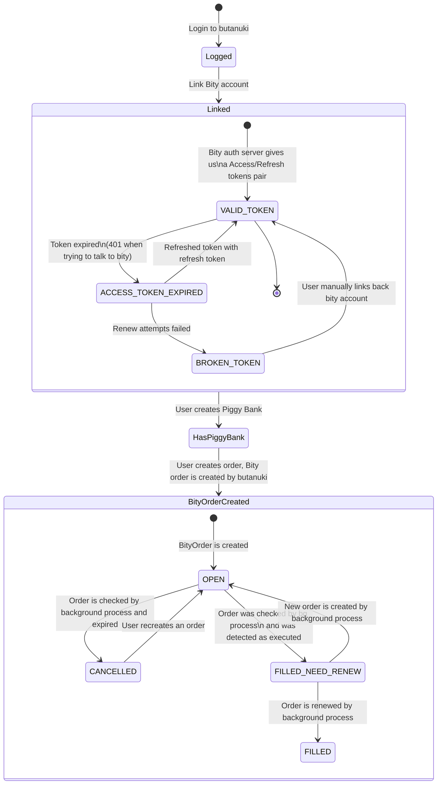

## Description

[Butanuki](https://butanuki.com) core source code

## Installation

```bash
$ npm install
```

## Running the app

```bash
# start api dev
$ cd butanuki-api && npm run start:dev

# start background processor dev
$ cd butanuki-api && npm run start-scheduler:dev

# start front dev
$ cd butanuki-front && npm run dev
```

## Test

```bash
# unit tests
$ cd butanuki-api && npm run test
```

## Background process flowchart


## Stay in touch
- Website - [https://butanuki.com](https://butanuki.com)
- Twitter - [@Butanuki21](https://twitter.com/Butanuki21)

## License

Butanuki is licensed [CC BY-NC-ND 4.0](LICENSE)
